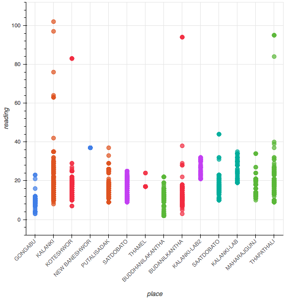
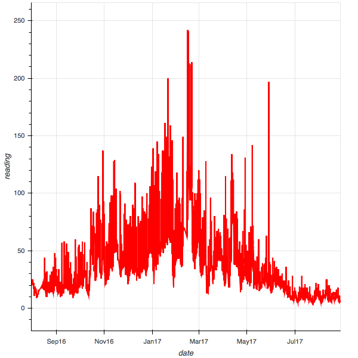

# Drishti Kathmandu Air Quality Monitoring Data

Generating CSV from [Drishti Google Sheets](https://docs.google.com/spreadsheets/d/1J2I40hglES63YZHROcOL3oAjDPqiiKLRPE_ikAWsR-Q/pubhtml?gid=1267634591&single=true)

Read more at [rvibek.com.np](http://rvibek.com.np/csv-from-drishti-kathmandu-valley-air-quality/)

**Added Python Notebook**
I have added Python notebook to create charts

*data as of 2016.12.29*

*KOTESHWOR - data as of 2017.08.27*

*SATDOBATO - data as of 2017.08.27*
